# RiskIntel360 System Architecture - Factual Mermaid Diagram

## Actually Implemented Components Only

```mermaid
flowchart TD
    %% Client Layer (Verified)
    Client[React 18.2.0 Frontend<br/>Material-UI 5.14<br/>Port 3000]
    
    %% API Layer (Verified from main.py)
    FastAPI[FastAPI Application<br/>Python 3.13.7<br/>Port 8000]
    
    %% API Endpoints (Verified from actual files)
    subgraph "Actual API Endpoints"
        Health["/health<br/>health.py"]
        Auth["/api/v1/auth<br/>auth.py"]
        Users["/api/v1/users<br/>users.py"]
        Validations["/api/v1/validations<br/>validations.py"]
        Progress["/api/v1/progress<br/>progress.py"]
        CompDemo["/api/v1/demo<br/>competition_demo.py"]
        Fintech["/api/v1/fintech<br/>fintech_endpoints.py"]
        CostMgmt["/api/v1/cost<br/>cost_management.py"]
        Performance["/api/v1/performance<br/>performance.py"]
        Credentials["/api/v1/credentials<br/>credentials.py"]
        Visualizations["/api/v1/visualizations<br/>visualizations.py"]
        WebSocket["/api/v1/ws<br/>websockets.py"]
    end
    
    %% Services Layer (Verified from actual files)
    subgraph "Backend Services"
        CompetitionDemo[Competition Demo Service<br/>competition_demo.py<br/>Demo Scenarios & Metrics]
        CostManagement[Cost Management Service<br/>cost_management.py<br/>AWS Cost Tracking]
        SmartModelSelection[Smart Model Selection<br/>smart_model_selection.py<br/>Model Optimization]
        CredentialManager[Credential Manager<br/>credential_manager.py<br/>AWS Credential Management]
    end
    
    %% Agent Layer (Verified from agentcore directory)
    subgraph "AgentCore Agents"
        RegAgent[Regulatory Compliance Agent<br/>regulatory_compliance_agent.py]
        FraudAgent[Fraud Detection Agent<br/>fraud_detection_agent.py]
        RiskAgent[Risk Assessment Agent<br/>risk_assessment_agent.py]
        MarketAgent[Market Intelligence Agent<br/>market_intelligence_agent.py]
        KYCAgent[KYC Verification Agent<br/>kyc_verification_agent.py]
        Orchestrator[Agent Orchestrator<br/>orchestrator.py]
    end
    
    %% AI Services (Verified from bedrock_client.py)
    subgraph "AI Integration"
        BedrockClient[Bedrock Client<br/>bedrock_client.py<br/>boto3 + Amazon Bedrock]
        WorkflowOrch[Workflow Orchestrator<br/>workflow_orchestrator.py<br/>LangGraph + AgentCore]
        AgentCoreClient[AgentCore Client<br/>agentcore_client.py<br/>Multi-Agent Coordination]
    end
    
    %% Database Layer (Verified from models/database.py)
    subgraph "Data Storage"
        SQLAlchemy[SQLAlchemy ORM<br/>database.py<br/>PostgreSQL Compatible]
        ValidationDB[ValidationRequestDB<br/>User Sessions<br/>Agent Results]
    end
    
    %% Frontend Components (Verified from src directory)
    subgraph "Frontend Pages"
        Dashboard[Dashboard<br/>Dashboard.tsx]
        CompetitionDemoPage[Competition Demo<br/>CompetitionDemo.tsx]
        ValidationResults[Validation Results<br/>ValidationResults.tsx]
        ComplianceDashboard[Compliance Dashboard<br/>ComplianceMonitoringDashboard.tsx]
    end
    
    %% Data Flow (Actual Implementation)
    Client --> FastAPI
    Client --> Dashboard
    Client --> CompetitionDemoPage
    Client --> ValidationResults
    Client --> ComplianceDashboard
    
    FastAPI --> Health
    FastAPI --> Auth
    FastAPI --> Users
    FastAPI --> Validations
    FastAPI --> Progress
    FastAPI --> CompDemo
    FastAPI --> Fintech
    FastAPI --> CostMgmt
    FastAPI --> Performance
    FastAPI --> Credentials
    FastAPI --> Visualizations
    FastAPI --> WebSocket
    
    CompDemo --> CompetitionDemo
    CostMgmt --> CostManagement
    Credentials --> CredentialManager
    
    CompetitionDemo --> Orchestrator
    Orchestrator --> RegAgent
    Orchestrator --> FraudAgent
    Orchestrator --> RiskAgent
    Orchestrator --> MarketAgent
    Orchestrator --> KYCAgent
    
    RegAgent --> BedrockClient
    FraudAgent --> BedrockClient
    RiskAgent --> BedrockClient
    MarketAgent --> BedrockClient
    KYCAgent --> BedrockClient
    
    WorkflowOrch --> AgentCoreClient
    Validations --> SQLAlchemy
    SQLAlchemy --> ValidationDB
    
    %% Styling
    classDef client fill:#E3F2FD,stroke:#1976D2,stroke-width:2px
    classDef api fill:#F3E5F5,stroke:#7B1FA2,stroke-width:2px
    classDef service fill:#E8F5E8,stroke:#388E3C,stroke-width:2px
    classDef agent fill:#FFF8E1,stroke:#FBC02D,stroke-width:2px
    classDef ai fill:#FF9800,stroke:#E65100,stroke-width:2px,color:#FFFFFF
    classDef storage fill:#FCE4EC,stroke:#C2185B,stroke-width:2px
    classDef frontend fill:#F1F8E9,stroke:#689F38,stroke-width:2px
    
    class Client,Dashboard,CompetitionDemoPage,ValidationResults,ComplianceDashboard client
    class FastAPI,Health,Auth,Users,Validations,Progress,CompDemo,Fintech,CostMgmt,Performance,Credentials,Visualizations,WebSocket api
    class CompetitionDemo,CostManagement,SmartModelSelection,CredentialManager service
    class RegAgent,FraudAgent,RiskAgent,MarketAgent,KYCAgent,Orchestrator agent
    class BedrockClient,WorkflowOrch,AgentCoreClient ai
    class SQLAlchemy,ValidationDB storage
```

## Actually Verified Technology Stack

### Frontend (Verified from package.json)
- **React 18.2.0** with Material-UI 5.14
- **Chart.js 4.4.0, Plotly.js 2.27.0, Recharts 2.8.0** for visualizations
- **Socket.io-client 4.7.4** for WebSocket connections
- **Axios 1.6.2** for HTTP requests

### Backend (Verified from requirements.txt + actual imports)
- **Python 3.13.7** with FastAPI
- **Pydantic v2** for data validation
- **SQLAlchemy 2.0** with PostgreSQL support
- **Boto3** for AWS integration (imported in bedrock_client.py)
- **LangChain + LangGraph** (imported in workflow_orchestrator.py)

### Actual File Structure (Verified)
- **12 API endpoint files** in riskintel360/api/
- **6 agent files** in riskintel360/agentcore/
- **4 main service files** in riskintel360/services/
- **4 frontend page components** in frontend/src/pages/
- **SQLAlchemy database models** in riskintel360/models/database.py

## Verified File Structure

### API Endpoints (Confirmed Files Exist)
| File | Purpose | Status |
|------|---------|--------|
| `health.py` | Health checks | ✅ Exists |
| `auth.py` | Authentication | ✅ Exists |
| `users.py` | User management | ✅ Exists |
| `validations.py` | Validation requests | ✅ Exists |
| `progress.py` | Progress tracking | ✅ Exists |
| `competition_demo.py` | Competition demo | ✅ Exists |
| `fintech_endpoints.py` | Financial analysis | ✅ Exists |
| `cost_management.py` | Cost management | ✅ Exists |
| `performance.py` | Performance monitoring | ✅ Exists |
| `credentials.py` | AWS credentials | ✅ Exists |
| `visualizations.py` | Data visualization | ✅ Exists |
| `websockets.py` | WebSocket updates | ✅ Exists |

### Agent Files (Confirmed in agentcore/)
| File | Purpose | Status |
|------|---------|--------|
| `regulatory_compliance_agent.py` | Regulatory compliance | ✅ Exists |
| `fraud_detection_agent.py` | Fraud detection | ✅ Exists |
| `risk_assessment_agent.py` | Risk assessment | ✅ Exists |
| `market_intelligence_agent.py` | Market intelligence | ✅ Exists |
| `kyc_verification_agent.py` | KYC verification | ✅ Exists |
| `orchestrator.py` | Agent coordination | ✅ Exists |

### Service Files (Confirmed in services/)
| File | Purpose | Status |
|------|---------|--------|
| `competition_demo.py` | Demo scenarios | ✅ Exists |
| `bedrock_client.py` | AWS Bedrock integration | ✅ Exists |
| `workflow_orchestrator.py` | Multi-agent workflows | ✅ Exists |
| `agentcore_client.py` | AgentCore coordination | ✅ Exists |

### Frontend Pages (Confirmed in frontend/src/pages/)
| File | Purpose | Status |
|------|---------|--------|
| `Dashboard.tsx` | Main dashboard | ✅ Exists |
| `CompetitionDemo.tsx` | Competition demo page | ✅ Exists |
| `ValidationResults.tsx` | Validation results | ✅ Exists |

This diagram shows only components that actually exist in the codebase.